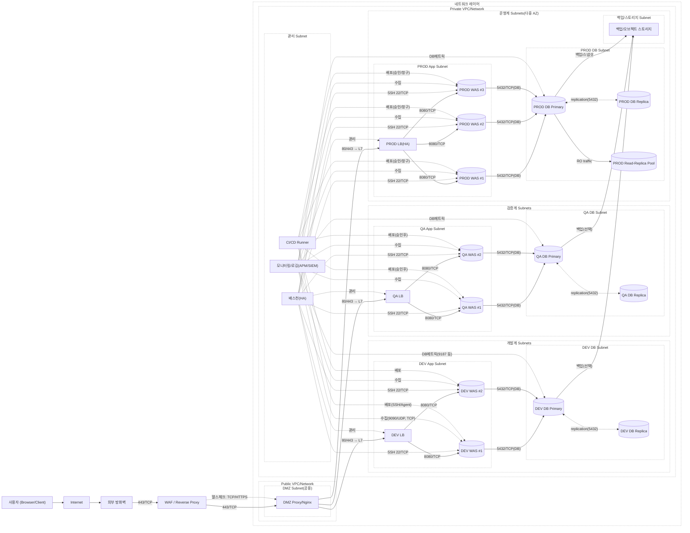

# test

## 🔧 전체 인프라 구조도

```mermaid
flowchart LR
  %% ====== 공통 외부 ======
  U["사용자 (Browser/Client)"]
  INET["Internet"]
  EXT_FW["외부 방화벽"]
  WAF["WAF / Reverse Proxy"]
  classDef zone fill:#fff,stroke:#999,stroke-width:1px,stroke-dasharray:3 3;

  %% ====== 네트워크 존/서브넷 ======
  subgraph NET["네트워크 레이어"]
  direction LR

    subgraph PUB["Public VPC/Network"]
    direction LR
      subgraph DMZ_SN["DMZ Subnet(공용)"]
      direction LR
        PROXY_D["DMZ Proxy/Nginx"]
      end
    end

    subgraph PRI["Private VPC/Network"]
    direction LR
      subgraph MGMT_SN["관리 Subnet"]
        BASTION["배스천(HA)"]
        MON["모니터링/로깅(APM/SIEM)"]
        CI["CI/CD Runner"]
      end

      %% ===== DEV =====
      subgraph DEV_SN["개발계 Subnets"]
      direction LR
        subgraph DEV_APP_SN["DEV App Subnet"]
          DEV_LB["DEV LB"]
          DEV_WAS1[("DEV WAS #1")]
          DEV_WAS2[("DEV WAS #2")]
        end
        subgraph DEV_DB_SN["DEV DB Subnet"]
          DEV_DB1[("DEV DB Primary")]
          DEV_DB2[("DEV DB Replica")]
        end
      end

      %% ===== QA =====
      subgraph QA_SN["검증계 Subnets"]
      direction LR
        subgraph QA_APP_SN["QA App Subnet"]
          QA_LB["QA LB"]
          QA_WAS1[("QA WAS #1")]
          QA_WAS2[("QA WAS #2")]
        end
        subgraph QA_DB_SN["QA DB Subnet"]
          QA_DB1[("QA DB Primary")]
          QA_DB2[("QA DB Replica")]
        end
      end

      %% ===== PROD =====
      subgraph PROD_SN["운영계 Subnets(다중 AZ)"]
      direction LR
        subgraph PROD_APP_SN["PROD App Subnet"]
          PROD_LB["PROD LB(HA)"]
          PROD_WAS1[("PROD WAS #1")]
          PROD_WAS2[("PROD WAS #2")]
          PROD_WAS3[("PROD WAS #3")]
        end
        subgraph PROD_DB_SN["PROD DB Subnet"]
          PROD_DB1[("PROD DB Primary")]
          PROD_DB2[("PROD DB Replica")]
          PROD_RR[("PROD Read-Replica Pool")]
        end
        subgraph PROD_BK_SN["백업/스토리지 Subnet"]
          BK["백업/오브젝트 스토리지"]
        end
      end
    end
  end

  %% ===== 외부 → DMZ → 내부 =====
  U --> INET --> EXT_FW -->|443/TCP| WAF -->|443/TCP| PROXY_D
  WAF -. "헬스체크: TCP/HTTPS" .-> PROXY_D

  %% ===== DMZ → 각 계 =====
  PROXY_D -->|"80/443 → L7"| DEV_LB
  PROXY_D -->|"80/443 → L7"| QA_LB
  PROXY_D -->|"80/443 → L7"| PROD_LB

  %% ===== LB → WAS =====
  DEV_LB -->|"8080/TCP"| DEV_WAS1
  DEV_LB -->|"8080/TCP"| DEV_WAS2
  QA_LB  -->|"8080/TCP"| QA_WAS1
  QA_LB  -->|"8080/TCP"| QA_WAS2
  PROD_LB -->|"8080/TCP"| PROD_WAS1
  PROD_LB -->|"8080/TCP"| PROD_WAS2
  PROD_LB -->|"8080/TCP"| PROD_WAS3

  %% ===== WAS → DB =====
  DEV_WAS1 -->|"5432/TCP(DB)"| DEV_DB1
  DEV_WAS2 -->|"5432/TCP(DB)"| DEV_DB1
  QA_WAS1  -->|"5432/TCP(DB)"| QA_DB1
  QA_WAS2  -->|"5432/TCP(DB)"| QA_DB1
  PROD_WAS1 -->|"5432/TCP(DB)"| PROD_DB1
  PROD_WAS2 -->|"5432/TCP(DB)"| PROD_DB1
  PROD_WAS3 -->|"5432/TCP(DB)"| PROD_DB1

  %% ===== DB 복제/읽기전용 =====
  DEV_DB1 <-. "replication(5432)" .-> DEV_DB2
  QA_DB1  <-. "replication(5432)" .-> QA_DB2
  PROD_DB1 <-. "replication(5432)" .-> PROD_DB2
  PROD_DB1 -->|"RO traffic"| PROD_RR

  %% ===== 관리/모니터링/배포 =====
  BASTION -. "SSH 22/TCP" .-> DEV_WAS1
  BASTION -. "SSH 22/TCP" .-> DEV_WAS2
  BASTION -. "SSH 22/TCP" .-> QA_WAS1
  BASTION -. "SSH 22/TCP" .-> QA_WAS2
  BASTION -. "SSH 22/TCP" .-> PROD_WAS1
  BASTION -. "SSH 22/TCP" .-> PROD_WAS2
  BASTION -. "SSH 22/TCP" .-> PROD_WAS3
  BASTION -. "관리" .-> DEV_LB
  BASTION -. "관리" .-> QA_LB
  BASTION -. "관리" .-> PROD_LB
  MON -. "수집(9090/UDP, TCP)" .-> DEV_WAS1
  MON -. "수집" .-> DEV_WAS2
  MON -. "수집" .-> QA_WAS1
  MON -. "수집" .-> QA_WAS2
  MON -. "수집" .-> PROD_WAS1
  MON -. "수집" .-> PROD_WAS2
  MON -. "수집" .-> PROD_WAS3
  MON -. "DB메트릭(9187 등)" .-> DEV_DB1
  MON -. "DB메트릭" .-> QA_DB1
  MON -. "DB메트릭" .-> PROD_DB1
  CI -. "배포(SSH/Agent)" .-> DEV_WAS1
  CI -. "배포" .-> DEV_WAS2
  CI -. "배포(승인후)" .-> QA_WAS1
  CI -. "배포(승인후)" .-> QA_WAS2
  CI -. "배포(승인/창구)" .-> PROD_WAS1
  CI -. "배포(승인/창구)" .-> PROD_WAS2
  CI -. "배포(승인/창구)" .-> PROD_WAS3

  %% ===== 백업 =====
  PROD_DB1 -->|"백업/스냅샷"| BK
  DEV_DB1  -->|"백업(선택)"| BK
  QA_DB1   -->|"백업(선택)"| BK

  %% ===== 스타일 =====
  class NET,PUB,PRI,DMZ_SN,MGMT_SN,DEV_SN,QA_SN,PROD_SN,DEV_APP_SN,DEV_DB_SN,QA_APP_SN,QA_DB_SN,PROD_APP_SN,PROD_DB_SN,PROD_BK_SN zone;


```
